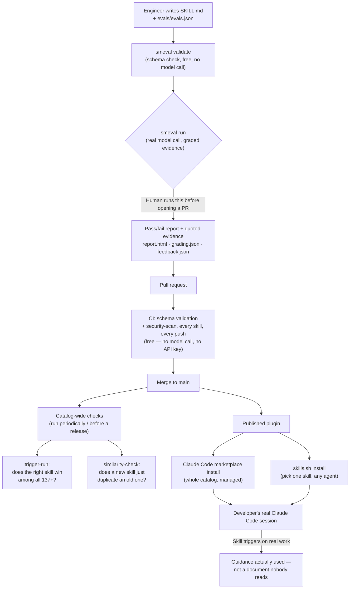

# skillme — Project Overview & Competitive Position

*A leadership-facing summary of what skillme is, how it works end to end,
and how it compares to the two most visible alternatives in the same
space: [obra/superpowers](https://github.com/obra/superpowers) and
[mattpocock/skills](https://github.com/mattpocock/skills).*

---

## 1. Executive summary

skillme is a catalog of 137+ Claude Code "skills" — reusable packets of
engineering guidance (Go concurrency, PostgreSQL partitioning, security
review, API design, and more) that an AI coding assistant loads on demand.
That much is a category that already exists; several public repositories
do it, including the two named above.

**What makes skillme different is not the content format — it's that every
claim in it is checked against a real model run before it ships, and the
catalog checks itself for three problems most collections never check for
at all: does the right skill actually get picked, is anything in it unsafe,
and does a new skill just duplicate an old one.** Neither comparison repo
does any of this. That gap is the whole basis of this document.

---

## 2. What skillme actually is

A **Claude Code plugin** (also installable into any Agent-Skills-compatible
tool, or as plain editable files via `skills.sh`) containing:

- **137+ skills**, each a `SKILL.md` (the guidance itself, written for the
  agent) plus an `evals/evals.json` (a small, deterministic test suite for
  that guidance).
- **`smeval`**, this repo's own Go eval runner (~2,000 lines, zero
  third-party dependencies), which actually runs each skill's test cases
  against a real Claude session in an isolated, disposable environment and
  grades the output against concrete evidence — not "looks right."
- A set of **catalog-wide tools** that check properties no single skill's
  test can check on its own (detailed in §4).

## 3. How it works, end to end

Two things about this flow are load-bearing, not cosmetic:

- **Every skill is isolated when tested.** `smeval` builds a throwaway,
  single-skill plugin for each test run, so a passing test proves *that
  skill* works — it isn't accidentally passing because some other skill in
  the catalog happened to cover for it.
- **The expensive step (a real model call) is never a CI gate.** Running
  all 137+ skills against a live model on every push would mean real
  dollars and 30+ minutes for a one-line change. Schema validation and the
  static security scan run free, on every push. The live check is a
  required, documented, pre-PR human step instead — cost is controlled
  without lowering the quality bar.

## 4. The three catalog-level checks nothing else in this space has

A single skill's test can only prove "this skill gives correct guidance
when it's the only thing installed." At 137+ skills, three different
questions become impossible to answer that way, and skillme is the only
one of the three catalogs compared here that answers any of them:

| Question | Tool | What it catches |
| --- | --- | --- |
| Does the model actually pick the *right* skill when many are available, and does a new skill silently steal triggers from an existing one? | `smeval trigger-run` | Two of Anthropic's own five official evaluation dimensions for Agent Skills at scale — neither comparison repo tests either one. |
| Is anything in a skill actually unsafe — a bundled script, a live network call, a hardcoded credential? | `smeval security-scan` | A static scan against Anthropic's own enterprise "Risk Tier" checklist, tuned (through testing against this exact catalog) to not cry wolf on skills that legitimately *teach about* security risks. |
| Does a proposed new skill just duplicate one that already exists? | `smeval similarity-check` | Lexical (TF-IDF) overlap across every skill description, surfaced for a human to review before a near-duplicate gets merged. |

All three are free to run — no API key, no per-run cost — and the first
one is wired into this repo's own CI.

## 5. Direct comparison

| | **skillme** | **superpowers** (obra) | **skills** (mattpocock) |
| --- | --- | --- | --- |
| Scale | 137+ skills | 14 skills | 36 skills |
| Content focus | Domain + process (Go, Postgres, security, product mgmt, *and* agentic-engineering process) | 100% process/workflow (TDD, debugging, brainstorming, git worktrees) — no domain content | Mostly TypeScript-engineer workflow (TDD, code review, domain modeling) — some depth, no deep infra/security content |
| Per-skill automated test | **Yes** — prompt + assertions, graded against a real model run, evidence-quoted | **No** per-skill eval found; its `tests/` directory tests the *framework's own mechanics* (worktree policy, subagent handoff), not skill content | **No** eval/test file found in any sampled skill directory |
| CI quality gate | **Yes** — schema + security-scan on every push, all skills | **None found** — `.github/` has only issue/PR templates, no `workflows/` | **Exists but isn't a quality gate** — a Changesets version/publish pipeline, no test execution step |
| Security scanning | **Yes** — static Risk Tier scan, every skill, every push | None found | None found |
| Duplicate-coverage detection | **Yes** — TF-IDF similarity across all descriptions | None found | None found |
| Cross-skill trigger/coexistence testing | **Yes** — whole catalog installed at once, graded | None found | None found |
| Versioning/release process | Plugin `version` + git tags | Real — `.version-bump.json` + a substantial `RELEASE-NOTES.md` | Real — Changesets-driven npm-style release |
| Audience | Any Agent-Skills-compatible tool; engineering + process + product | Broad, explicitly cross-harness (13 harnesses listed) | Individual TypeScript engineers, newsletter-distributed |

*(Comparison figures and quotes sourced directly from each repo's GitHub
API contents listing and README as of this document's writing; see
citations in the research notes retained with this document's change
history.)*

## 6. The honest caveat

Both comparison repos are real, popular, and well-maintained — this isn't
"they're bad, we're good." Superpowers in particular is a serious,
thoughtful piece of engineering-process design, and its scope (a complete
cross-harness development methodology) is different from skillme's
(domain + process knowledge for one skill-loading model). The comparison
that matters isn't "more skills" or "prettier docs" — it's this: **neither
alternative has any mechanism to prove a skill actually works, stays safe,
or doesn't duplicate another one, before it ships.** They ask the reader to
trust the author. skillme asks for evidence instead, and provides the
tooling to keep generating that evidence as the catalog grows.

## 7. Why this matters going forward

- **Quality doesn't degrade as the catalog grows.** The three catalog-wide
  checks in §4 exist specifically because "it worked when it was 20
  skills" stops being true past a certain scale — and 137+ is well past
  it.
- **Every claim in this document about skillme is independently
  reproducible.** `make ci`, `make validate-all`, `make security-scan-all`,
  and `make similarity-check` all run locally, produce the same evidence
  cited here, and cost nothing to run again.
- **The tooling is the reusable asset, not just the content.** A team that
  wants its own internally-consistent set of engineering skills can fork
  this repo's `smeval` layer wholesale — it's a working reference
  implementation of an eval-driven skill catalog, not a description of one.
